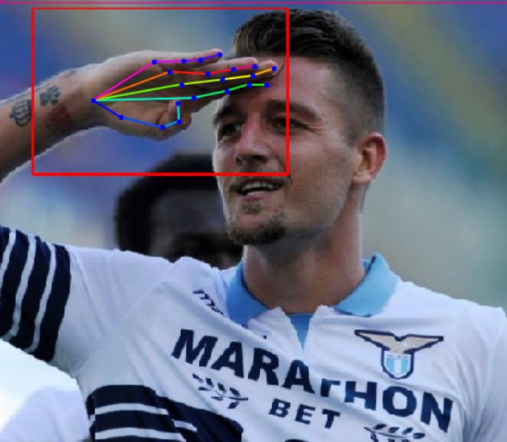

# Handpose-estimator　　

Repositpry for a simple handpose estimator. Openpose based hand pose estimator searches the hand position based on the skeleton keypoints which starts from the persons head. This means when some keypoints of the upper body is occluded, estimating the handpose will be difficult(Second example). By using the TTFNet to estimate the hand position directly, it will be able to estimate handpose in occluded cases too. 

|Openpose Base|Handpose-estimator (This repository)|
|---   |---     |
|||
|||

# setup  

## Step1  

Load each model from the URL and make the weights file to use them.  
Make sure the directory level, names and pth names are the same.
(The pretrained.pth will be downloaded by a different name, so dont forget to change it!)

```
handpose-estimator (top directory)
  /weights  
    /openpose    
        /body_pose_model.pth
        /hand_pose_model.pth   
    /ssd
        /pretrained.pth
    /ttfnet 
        /latest.pth
```  

- Weights　URL
    - [openpose](https://www.dropbox.com/sh/7xbup2qsn7vvjxo/AABWFksdlgOMXR_r5v3RwKRYa?dl=0)
    - [ssd](https://s3.amazonaws.com/amdegroot-models/ssd300_mAP_77.43_v2.pth)  
    - [ttfnet](https://github.com/t-koba-96/rpn/releases/download/ttfnet_weight/latest.pth)


## Step2  

 Since TTFNet uses the packages of mmdetection, there is a need to install mmdetection. Check out [Install.md](https://github.com/open-mmlab/mmdetection/blob/master/docs/INSTALL.md) of the mmdetection page and make sure your environment fulfills the requirements.  

 After checking, run 

 ``` 
$ pip install -r requirements/build.txt　　
$ pip install -v -e .  # or "python setup.py develop"
```  

If you want to know how to train the TTFNet using your one dataset, check out [ttfnet.md](./ttfnet.md) for more information (Sorry, only written in Japanese). 


## test the demo  


``` 
handpose-estimator (top directory)  
  /demo  
    /input  
        /**.jpg  
        /**.mp4  
    /output  
```  

## testing code  

Their are two codes you can test, img_test.py and video_test.py.  
For both of them ,you can chose the openpose model or the handpose model.

For img_test.py try 

``` 
$ python img_test.py [mode(chose "handpose" or "openpose" )]
```  


For video_test.py try 

``` 
$ python video_test.py [mode(chose "handpose" or "openpose" )] [video(e.g. test.mp4 , cooking.avi)]
```  
  
