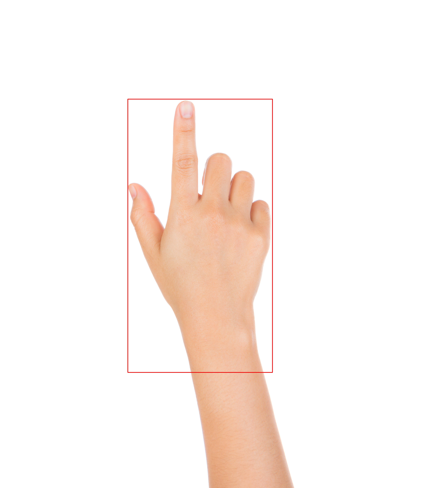

# TTFNetで手領域検出

### 元論文
https://arxiv.org/abs/1909.00700

### 著者実装
https://github.com/ZJULearning/ttfnet


## インストール
[INSTALL.md](https://github.com/open-mmlab/mmdetection/blob/master/docs/INSTALL.md)を参考にしてmmdetectionをインストール


## 学習
学習済みモデルだけ使いたい人はスルー

### データセットの用意
今回は[EgoHands](http://vision.soic.indiana.edu/projects/egohands/)データセットを利用

`./data/EgoHands/`に訓練データをダウンロード
```
wget http://vision.soic.indiana.edu/egohands_files/egohands_data.zip
unzip egohands_data.zip -d ./data/EgoHands/
rm egohands_data.zip
```

### アノテーションの用意
TTFNetはmmdetectionというツールを利用
COCOとPASCAL VOCデータセット以外(EgoHandsなど)を使うとき、アノテーションのフォーマットを整える必要あり

EgoHandsについては既に[annotate_egohands.py](./src/annotate_egohands.py)で生成したものが`./data/EgoHands/annotations/`に配置済み


### 学習
```
python ./tools/train.py ${CONFIG_FILE}
```

学習済みモデルの*CONFIG_FILE*はすでに`./src/configs/ttfnet.py`にある
学習のログやモデルは`./work_dirs/ttfnet/`に保存


## 推論
指定した動画(*VIDEO*)に対して推論を行い、予測した手の位置(bounding box)を重ねて描画した動画(*RESULT*)を生成
```
python ./src/inference.py ${CONFIG_FILE} ${CHECKPOINT_FILE} ${VIDEO} ${RESULT}
```

学習済みモデルのものは`./src/configs/ttfnet.py`にある
*CHECKPOINT_FILE*は学習で保存されたモデルのファイル

## （example）  

|元画像|推論結果|
|---   |---     |
|||
